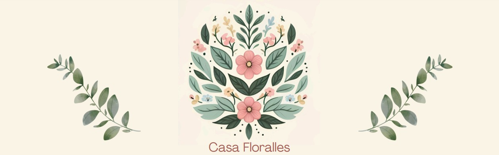

# Sobre nós
O projeto **"Casa Floralles"** uma equipe composta por profissionais dedicadas. **Eloá Pereira Florêncio**, como ***Product Owner/Scrum Master (P.O./S.M.)***, é responsável por organizar o projeto e aplicar a metodologia ágil. **Beatriz Gabrielle Vizeu de Salles**, responsável pelo ***UX/UI***, foca na experiência do usuário e no design de uma interface intuitiva. **Laila Casadei Macêdo**, à frente do ***DevOps***, garante a infraestrutura e a eficiência técnica da plataforma. Juntas, buscamos desenvolver um sistema inovador e funcional para otimizar a rotina dos floricultores e melhorar a experiência dos clientes.

 
  

# Escolha da metodologia

Optamos pela metodologia **Lean Development** pois ela ajuda a desenvolver o sistema de forma mais eficiente. Com essa abordagem **conseguimos manter o sistema sempre alinhado com as necessidades da loja e dos clientes.**

> [!NOTE]
>As principais características dessa metodologia são:
>- Redução de desperdícios
>- Entrega rápida
>- Feedback contínuo
>- Foco no valor ao cliente
>- Flexibilidade e adaptação

## Definição do Projeto

Manter as atividades organizadas é essencial para um bom atendimento e maior conforto aos clientes. Com isso, o objetivo deste projeto é **criar um sistema para ajudar uma floricultura a organizar, classificar e nomear suas plantas, fornecendo informações como nome, espécie, classificação botânica e imagem ilustrativa.** Essa ferramenta permitirá melhorar os processos internos da loja, evitar erros na identificação das espécies e oferecer um atendimento mais rápido e personalizado, garantindo maior satisfação dos clientes e mais eficiência operacional.

